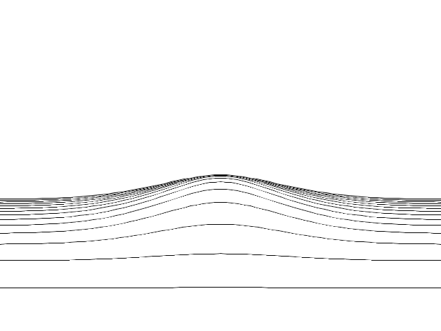

# ripple-lines  [](https://travis-ci.org/vidstige/ripple-lines)

Javascript that draws heightmap using lines.


_Screenshot_


_Render_

## Trying it out
```bash
npm start
```

## Author
Samuel Carlsson
